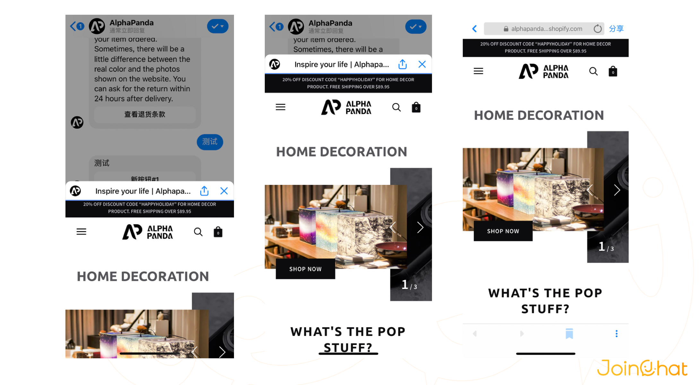

# 按钮类型

## 网址按钮

网址按钮用于在 Messenger 网页视图中打开网页。这方便您利用网页体验丰富对话内容，且您可以充分利用网页开发的灵活性打造网页体验。例如，您可以在对话中展示产品摘要，然后使用网址按钮打开您网站中完整的产品页面。

用户实际在Messenger中点击这个网址按钮，会在Messenger内部通过内嵌浏览器打开这个网址，您可以选择视窗高度。

## 回传按钮

您可以在用户轻触回传按钮时执行任意操作。例如，您可以展示产品列表，然后在回传中向用户以结构化消息的形式返回产品详情。可以选择新建一个消息或选择一个用户已经创建的消息。

## 登陆按钮

登录按钮用于帐户绑定流程，您可以使用这个按钮将消息接收人链接到您的网页登录流程，进行身份验证，继而将他们的 Messenger 帐户与他们在您网站上的帐户绑定，以便为用户提供更精准的服务，例如：

* 为用户提供订单的回执和发货提醒
* 用户在Messenger中下单之后，可以将订单纳入您的订单管理系统中
* 根据用户在您网站上的订购和浏览情况，客服可以在Messenger中和用户进行更有效的沟通

## 分享按钮

消息接收人可通过分享按钮与 Messenger 中的其他用户分享您发送的消息内容。分享的内容顶部会显示您的主页的名称和图标作为来源。用户轻触来源信息后，将打开与您的智能助手的对话。

借助分享按钮，您可以分享完整的消息，也可以在 `share_contents` 属性中指定新的常规模板消息。如果您指定新的常规模板，消息接收人可以在分享中添加内容。如果您想更改初始消息的展示效果或向初始消息添加内容，这一方案便尤其实用。

> 分享按钮可与下列菜单和模板结合使用：
>
> * 文本卡片
> * 列表卡片
> * 图片卡片
> * 视频卡片
> * 画册卡片

## 电话按钮

用户实际在Messenger中点击这个电话按钮，会直接拨打对应的电话号码。

轻触呼叫按钮即可拨打手机号。手机号的格式应为 `+<COUNTRY_CODE><PHONE_NUMBER>`，例如 `+15105559999`

## 快捷回复

快捷回复可以用在文本卡片、图片卡片、画册卡片、视频卡片、输入卡片、商品选取卡片、商品搜索卡片下面，最多一组设置11个快捷消息供用户选择。快捷回复支持文本类型，可以为该快捷回复关联消息块、动作块或者消息流。轻触“快速回复”后，系统将自动返回关联的内容。

> #### 最佳实践
>
> 使用按钮为特定消息提示后续操作或进一步互动。
>
> 以动词开头，这样有助于用户了解自己采取的操作。
>
> 将网址按钮用于您希望用户在网站上完成的任务（例如，购买、帐户绑定等）。明确说明您会将用户引导至 Messenger 以外的地方。
>
> 在用户轻触回传按钮后发送回复。这可用于确认您已处理或完成用户的操作（例如：取消预订、回答问题）。
>
> 如果按钮操作取决于智能助手的当前状态，则不要使用按钮，因为按钮会在对话中始终显示。
>
> 尽量将文本的字符数量保持在 5个以内（含空格）。
>
> 不建议为每个按钮添加网址。您在 Messenger 中建立的互动越多，所打造的体验就越连贯。
>
> 不建议仅使用一个回传按钮。如果只有一个按钮，用户通常会认为它是消息文本的延续，而不会认为它是您希望他们采取的操作。

