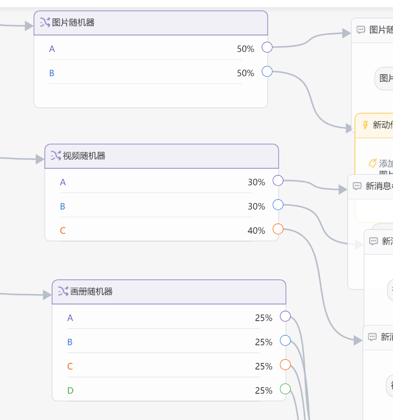
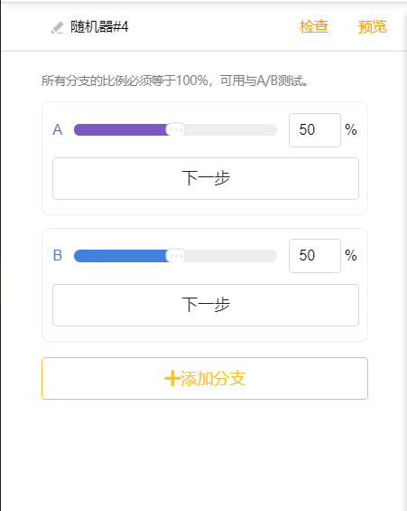

# 组成结构

## 消息块

消息块是Messenger平台支持的各种形式可以发送给用户如文本、图片、画册、视频以及JoinChat提供的各种类型卡片，如下图：

Messenger支持在使用卡片过程中可以与用户进行交互，如文本卡片最多支持设置3个按钮。

消息块方便用户快速设定一次性回复给用户多条组合在一起的内容，比如 文本+图片、文本+视频等，使得您在[智能客服](https://app.gitbook.com/@joinchat/s/project/~/drafts/-M3EougYE79n0hgYbUR4/general-function)和[广播群发](../zhi-neng-ying-xiao/guang-bo-qun-fa.md)等功能中使用。

## 动作块

您可以通过给任何按钮添加一个动作，用于完成机器人自动触发的特定行为：

### 添加标签和取消标签

通过用户的行为认知，给用户赋予特定的标识，可以帮助您丰富用户画像，更好地划分用户群。

管理全部标签则在设置-[属性/标签](../she-zhi/ji-chu-she-zhi/shu-xing-biao-qian.md)中进行。

### ~~~~

### 设置用户属性和清除用户属性

该动作可以给用户创建/清除某些特定的属性，如性别、电话、邮箱等。通过该动作收集用户信息后存入用户详情中。为了准确的收集特定信息，我们支持以下四类属性：

| 属性类型 | 用例 |
| :--- | :--- |
| 文本类型 | 如地址、邮箱 |
| 数字类型 | 如年龄、电话号 |
| 日期类型 | 如生日 |
| 时间类型 | 如用餐时间 |

管理全部属性则在设置-[属性/标签](../she-zhi/ji-chu-she-zhi/shu-xing-biao-qian.md)中进行。

### 呼叫人工客服

该动作用于用户点击特定按钮后，由人工来继续服务以达到更好的效果。

### 订阅机器人和取消订阅机器人

为了提供更好的用户体验，建议运营人员在新用户首次接触机器人时，对用户进行友好提示，仅对同意订阅机器人并触发“订阅机器人”动作的用户进行主动推送营销类或非营销类消息。

### 查询订单

该功能为电商高级工具，为用户提供便捷的途径进行订单查询。使用该功能前需确保您已经完成店铺绑定，具体使用说明可见[顾客查询订单&包裹](../advanced-functions/gu-ke-cha-xun.md#gu-ke-cha-xun-ding-dan-bao-guo-zhuang-tai)。

### 开启/关闭翻译

JoinChat内置了谷歌翻译功能，可以通过识别用户的语言将配置的内容翻译成用户的语言。

> 举例：JoinChat的官方机器人内容全部由英文配置，当一个法国的Messenger用户和机器人对话所触发的所有内容都为英文，只要用户触发了开启翻译功能，则可以将JoinChat配置的内容全部以法语推送到用户的Messenger中。为了给用户一定的选择性，建议运营人员在固定菜单中可以让用户快速找到开启翻译和关闭翻译按钮，将选择交给用户。


由于所有翻译功能有谷歌翻译提供，因此翻译的效果取决于谷歌翻译软件本身的识别率，针对语言混搭（文本中出现多种语言和表情符号等）会对翻译效果造成一定影响，因此请运营人员注意。


## 随机器

随机器是JoinChat系统的高级进阶功能，随机器实现了多分支业务流，它使得智能回复内容不再单一化和固定化，更加贴合实际应用，使业务更加趣味化、人性化及智能化。

目前随机器支持分支数量至少2条，最多10条。所有分支值之和必须等于100%，每个分支回复内容可根据需求选择消息块或动作或随机器。

## 消息流

消息流是由[消息块](zu-cheng-jie-gou.md#xiao-xi-kuai)、~~和~~[动作块](zu-cheng-jie-gou.md#dong-zuo-kuai)和[随机器](https://app.gitbook.com/@joinchat/s/project/~/drafts/-M3EVJufs5SJjkSA9_LC/basic-knowledge/zu-cheng-jie-gou#sui-ji-qi)按照运营人员引导用户进行交互体验的内容集合，作为某个完整对话情景的集合体，每个消息块和动作块都是通过按钮进行逻辑关联。

消息流中，有一个特别的标识“起始点“，作为整个消息流中的第一个消息块，在触发该消息流时，机器人会自动推送带有“起始点“标识的消息块。同时，您可以拖动“起始点“用于变更触发的第一个消息块。

我们在创建[固定菜单](../general-function/gu-ding-cai-dan.md)中的每一个按钮、[欢迎回复](../she-zhi/ji-chu-she-zhi/huan-ying-hui-fu.md)、[默认回复](../she-zhi/ji-chu-she-zhi/wei-zhi-hui-fu.md)、每一条[关键词回复](../general-function/ai-hui-fu.md)、每一条[计划回复]()都视为一个独立的消息流。为了便于内容的区分及管理，可以在[内容管理](../general-function/)中创建一个新的消息流，同时进行消息流的管理。

