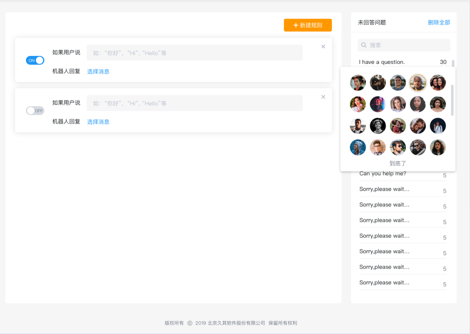

# 关键词回复

用户与机器人进行互动时，除了通过各种按钮与快捷回复的「点击」，还可以通过直接「输入文本」来进行。这就需要我们在设置机器人的时候，对用户可能会输入的关键词，进行相应的回复设置，也就是设置关键词回复规则。

每一条规则主要包含两部分内容：「用户说」和「机器人回复」

「用户说」即配置用户可能咨询问题的关键字，可以设置多条。

「机器人回复」即预设的回复内容，JoinChat系统默认回复内容包含welcome Reply和default Reply消息。运营人员可以根据业务需求创建更多的预设回复内容，预设回复内容创建在智能回复--对话场景模块，更多创建及编辑回复内容操作流程详见使用手册对话场景部分。

关键词回复规则的设置主要就是模拟机器人与用户进行对话的可能，如果用户说的话中包含了一些特定关键词，则会触发预设的回复内容。只有当规则越多越完善，机器人则越智能。

运营人员可以输入多个关键词，当用户输入的内容与您设置的关键词相匹配时，则会触发预设内容，目前针对关键词机器人采取的是包含匹配，户输入的内容包含您设置的关键词就会自动触发。

您也可以不设置任何内容块，则意味机器人不回复任何内容，为了更好的交互，我们当然不建议您这么做。

场景一：响应用户输入的问候语

预期：希望当用户输入类似于“Hi”，”Hello” 的短语时，回复用户“欢迎消息”

操作步骤：

1-前往【智能回复】-【关键词回复】界面

2-在右上角点击【新建规则】

3-点击「用户说」这个区域，在输入框中输入关键词“Hi”，回车保存后继续输入下一个关键词 “Hello”回车保存 

4-「机器人回复内容块」中，选择“已有对话”，在“已有对话”列表选择「欢迎回复」，保存 

5-确保启用开关已经打开

场景二：响应用户输入的咨询产品价格

预期：希望当用户输入类似于“产品A价格”，”价格” 的短语时，回复用户价格相关问题

操作步骤：

1-前往系统【智能回复】-【对话场景】界面

2-在右上角点击【新建】，对业务Flow命名「价格」

3-进入新建场景界面后，根据业务创建价格业务流，保存，发布

4-前往系统【智能回复】-【关键词回复】界面

5-在右上角点击【新建规则】，点击「用户说」这个区域，在输入框中输入关键词“价格”，回车保存

6-「机器人回复内容块」中，选择“已有对话”，在“已有对话”列表选择「价格」，保存

为了不断提高机器人的智能化程度，Joinchat系统在AI回复功能中添加了「未匹配的问题」功能模块，在这个模块当中会显示所有机器人没有作出正面回答的所有问题以及问题所对应的咨询次数，根据「未匹配的问题」功能模块列表问题统计既可以帮忙运营人员了解用户有哪些问题没有被满足，同时辅助决策是否对某一集中问题进行AI内容的设置，从而使机器人更加智能化。

