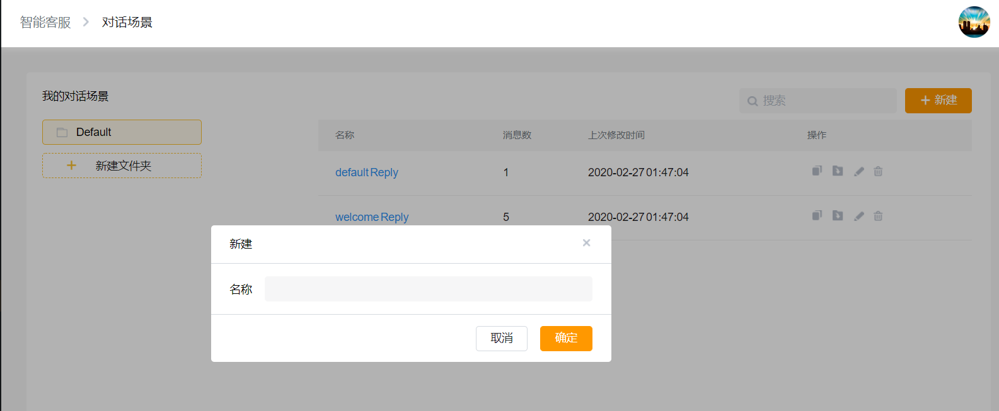
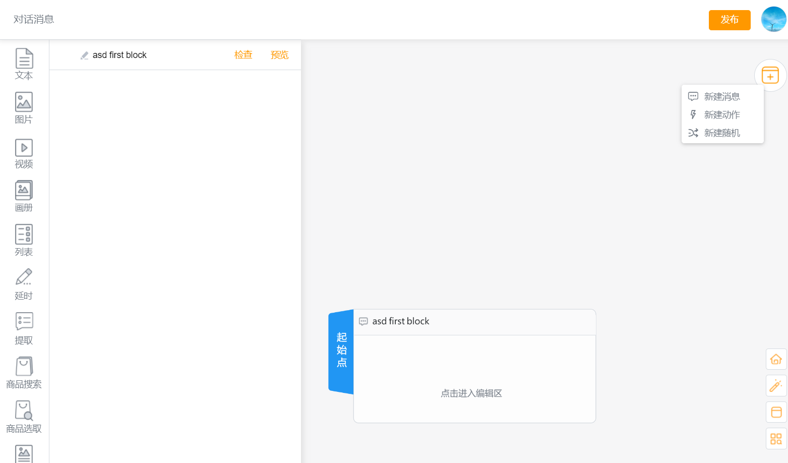
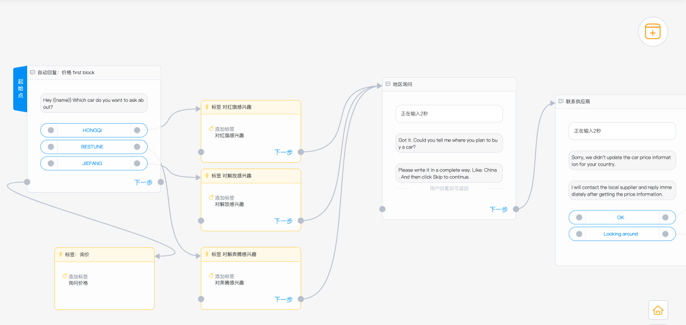

# 对话场景

## 消息流管理

进入对话场景页面默认显示所有的消息流，为了方便用户使用消息流，我们支持用户创建不属于系统默认的消息入口（服务菜单、关键词回复）的独立消息流。

点击消息流，直接进入到画板，查看该消息流所有的消息块、动作块和随机器，以及他们之间的前后跳转关系。

消息流列表页面左侧文件夹列表实现了消息流分类管理功能，用户可根据业务需求分类管理消息流。

消息流列表的复制、编辑、删除及移动功能大大提高了消息流易操作性。


请注意：由于欢迎回复和默认回复是系统默认的消息流，因此无法进行删除，除非您在关键词回复中，解除功能与消息的绑定关系。


## 消息流构成

消息流主要由消息块、动作块和随机器构成，用户在设计业务Flow时可根据实时业务来选择消息块、动作块或随机器。

### 消息块

消息编辑框内包含文本、图片、视频、画册、延时、提取、商品搜索、商品选取、图文消息、趣味卡片等消息卡片。这些卡片基本涵盖了业务内所需素材，大大提高了用户便捷性。

### 动作块

动作编辑框提供了标签、订阅计划、用户属性、机器人、人工客服、订单、翻译等功能，实现科学的用户管理，为实现销售漏斗转化提供了功能基础。

### 随机器

随机器实现了多分支业务Flow流，随机器提供了多分支流，使业务Flow更加实用及智能化。目前随机器支持分支数量至少2条，最多10条。


随机器是JoinChat高级进阶功能，免费版用户可以创建但不可以发布，体验版及以上版本用户方可使用随机器。


## 消息流创建

1、进入智能回复---对话场景界面，点击“新建”，在弹出对话框对业务Flow命名后，点击确定即可进入对话流创建界面：

2、进入创建界面后即可根据业务需求创建业务流，营销中需要的文本、图片、视频等消息编辑块都可满足，对客户的划分、归类等都可通过动作块中功能来达到预期效果。另外，复制等功能也大大提升了消息Flow的设计效率，创建界面功能详见附图：

## ~~消息块/动作块/随机器管理~~

~~点击消息块按钮，默认显示所有的消息块。为了便于浏览，支持按消息块/动作块的归属进行筛选。点击某一消息块/动作块，则进入到该消息块的画布中，查看前后跳转之间到关系。~~

~~为了不影响机器人的正常运转，我们不支持删除消息块/动作块，如需删除则需要进入到画布中进行删除，以免影响前后内容的关联性。~~

