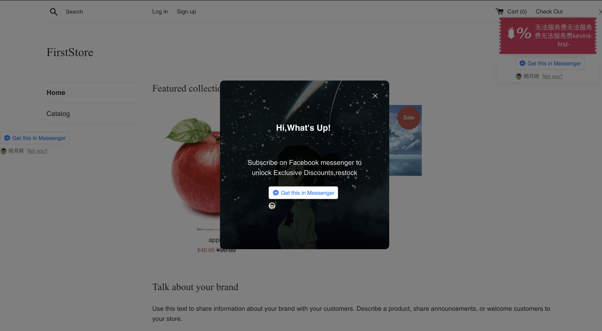

# SDK管理

JoinChat集成的SDK追踪代码，可为绑定shopify的商户追踪用户在浏览网站时候的行为路径如新访客、旧访客、浏览过的商品等，能够帮您分析PC端、无线端、Messenger内页面的购买活动‘通过成效报告可以了解商品交易信息、订单数、金额、转化率、投资回报率等指标。只需要选择以下一个或多个插件，将生成的代码复制并粘贴到您要跟踪的网站中。

在这里首先建议您根据自己的商家类型进行选择。

SDK推广插件不同之处在于，在插入SDK代码后，我们可在SDK管理页面快速管理已经创建插件的使用情况。因为在之前的推广插件中，如果需要安装插件则需要在代码中植入其中一个插件的代码，取消插件则需要移除代码，针对使用多个插件的商家操作起来比较麻烦。SDK则可以有效的解决这类问题，可以非常便捷的管理插件的启用和停用、切换同类型不同的插件、插件显示的页面以及插件在页面中显示的位置。

优惠券插件在使用的过程中，为了实现对客户的友好交互，我们可以为触发优惠券的客户设置下次展示优惠券的时间间隔。

在使用SDK时，JoinChat为您提供一种行之有效的广告浮层，可以为首次登陆购物网站的用户展示您最想推广的商品，以及可以最大程度上引导用户点击插件获取优惠券码，相比与常规优惠券插件，这种新用户的广告弹层相对比较直接，通过两端文案的配置很大几率鼓励用户点击，实现用户的关联及追踪。

当客户关闭广告弹层后，在不清空浏览器缓存的情况下，将不会再收到该广告弹层。

