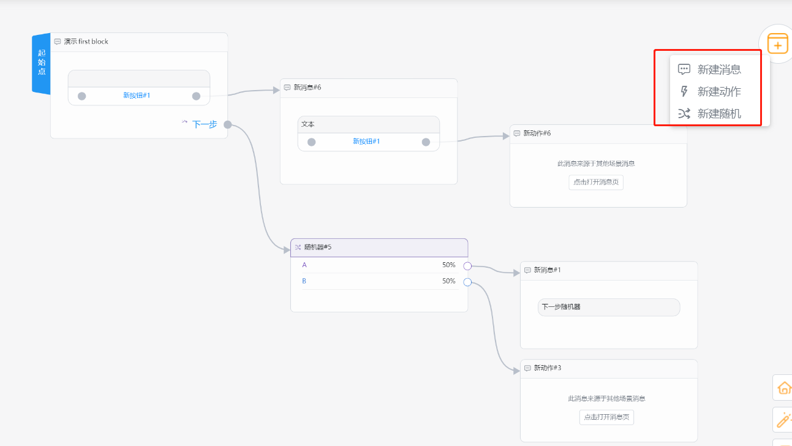
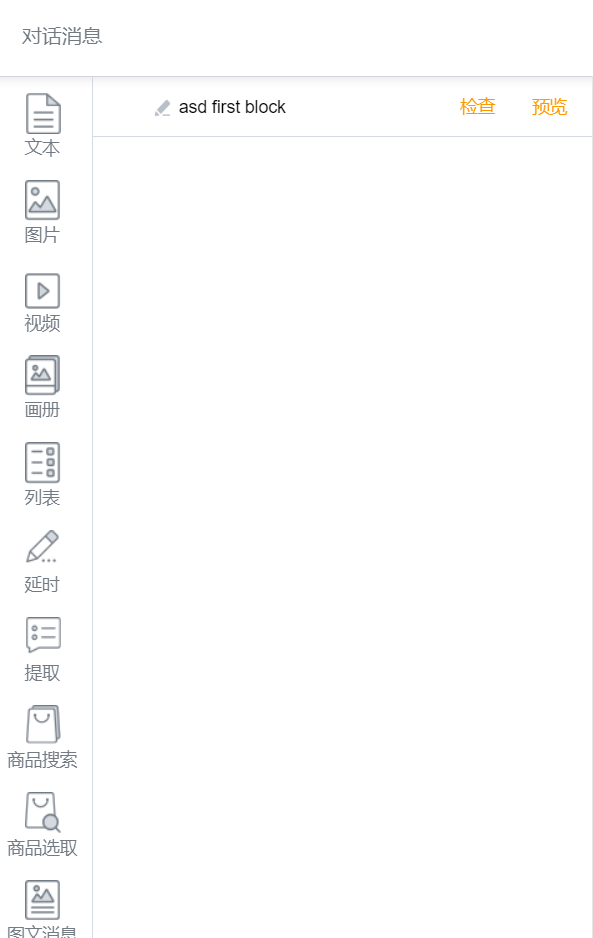
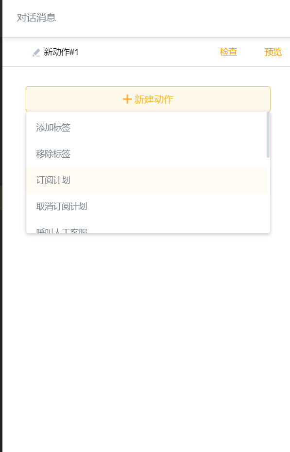
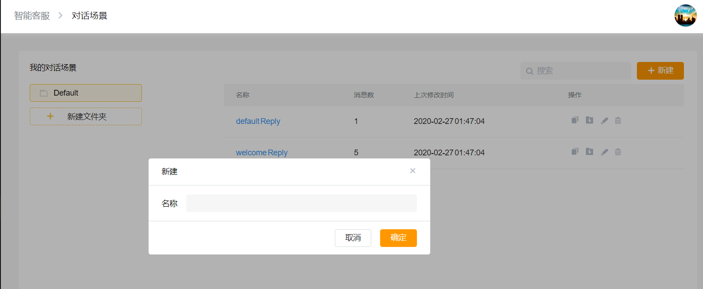
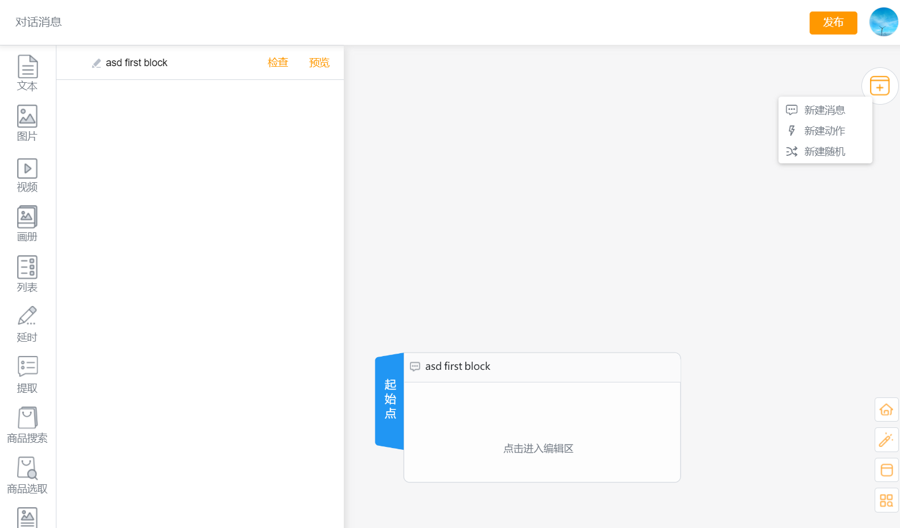
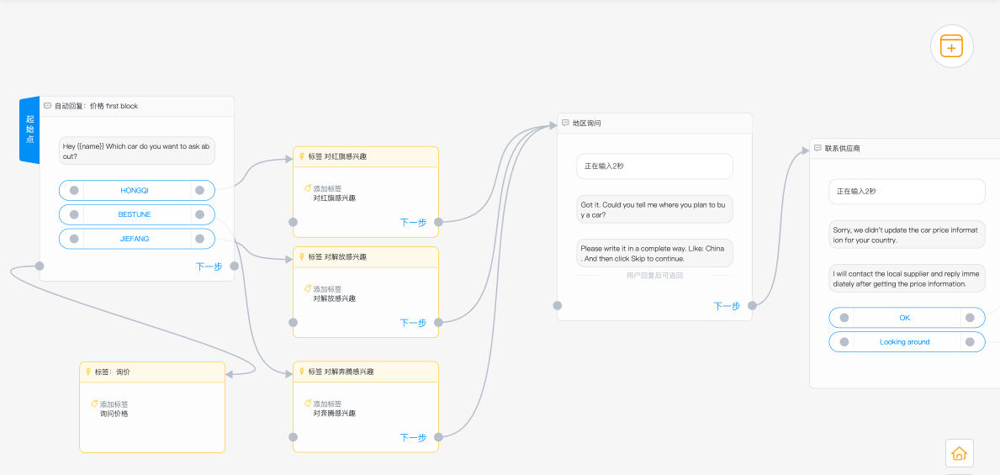

# 对话场景

对话场景（消息流Flow）主要由消息、动作、随机器构成，用户在设计业务Flow时可根据实时业务来选择消息、动作或随机器。

消息编辑框内包含文本、图片、视频、画册、延时、提取、商品搜索、商品选取、图文消息等卡片。这些卡片基本涵盖了业务内所需素材，大大提高了用户便捷性。

动作编辑框提供了标签、订阅计划、用户属性、机器人、人工客服、订单、翻译等功能实现科学的用户管理，为实现销售漏斗转化提供了功能基础。

随机器实现了多分支业务Flow流，随机器提供了多分支流，使业务Flow更加实用及智能化。目前随机器支持分支数量至少2条，最多10条。

#### 业务流Flow创建流程：

1、进入智能回复---对话场景界面，点击“新建”，在弹出对话框对业务Flow命名后，点击确定即可进入对话流创建界面：

2、进入创建界面后即可根据业务需求创建业务流，营销中需要的文本、图片、视频等消息编辑块都可满足，对客户的划分、归类等都可通过动作块中功能来达到预期效果。另外，复制等功能也大大提升了消息Flow的设计效率，创建界面功能详见附图：

