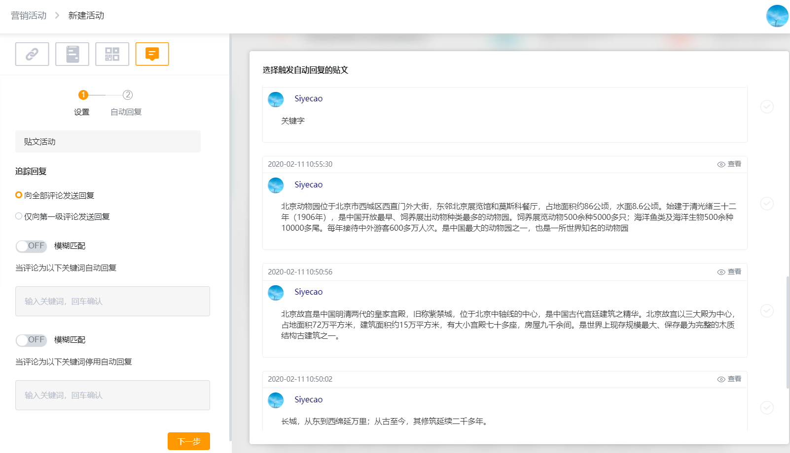
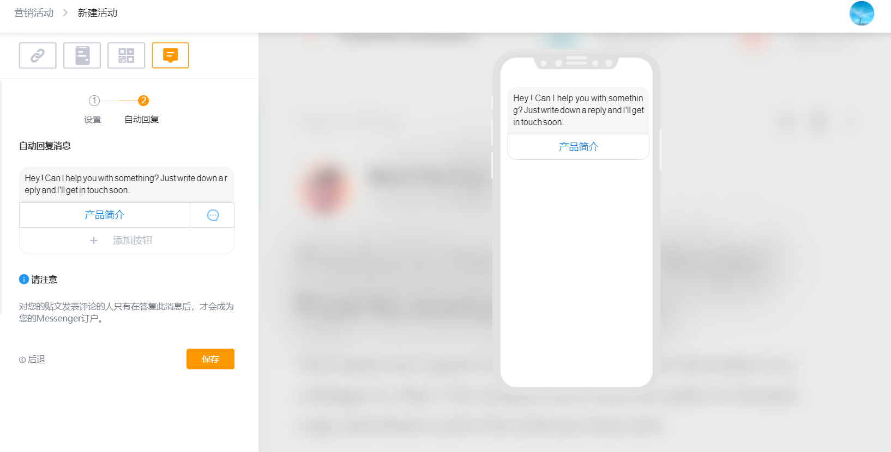

# 营销活动

## 消息浮层

## 消息嵌入

## 独立触点

### 可追踪的链接

### 在线聊天

### 二维码

### Facebook评论

Facebook评论可实现将特定帖子发表评论的用户转换为机器人用户。即当用户在你的Facebook帖子下回复内容后，系统会自动通过你的 Messenger 机器人向用户发一条消息。即可以通过Facebook 帖子获得用户流量。同时，我们还可以根据用户的不同评论内容发送特定的不同的消息，从而实现用户转化。

进入营销活动页面，首先会看到任务列表页，展示所有已创建的营销活动。点击右上角「新建活动」，选择营销活动类型界面，点击「Facebook评论」即可进入活动创建界面。

创建Facebook评论营销活动流程只需两步，即「设置」配置和「回复」配置。

Facebook评论营销活动「设置」界面可在帖子列表选择帖子来创建营销活动，设置界面包含功能模块有：活动名称、评论规则设置功能、关键字自动回复功能、帖子列表同步、帖子预览等功能。帖子列表与Facebook主页的帖子是同步的，可根据实际业务需求选择帖子及设置帖子评论关键字等功能，详见下图：

Facebook评论营销活动「回复」界面即用户评论后回复用户内容的配置界面，可根据业务需求回复用户文本内容或引用业务Flow等，从而实现用户信息采集及用户转化。

Facebook评论营销活动创建成功后，点击发布即可生效，用户在评论贴子时会收到设置的回复内容及转化成机器人用户。（配一个截图  用户评论后收到回复的配图）

