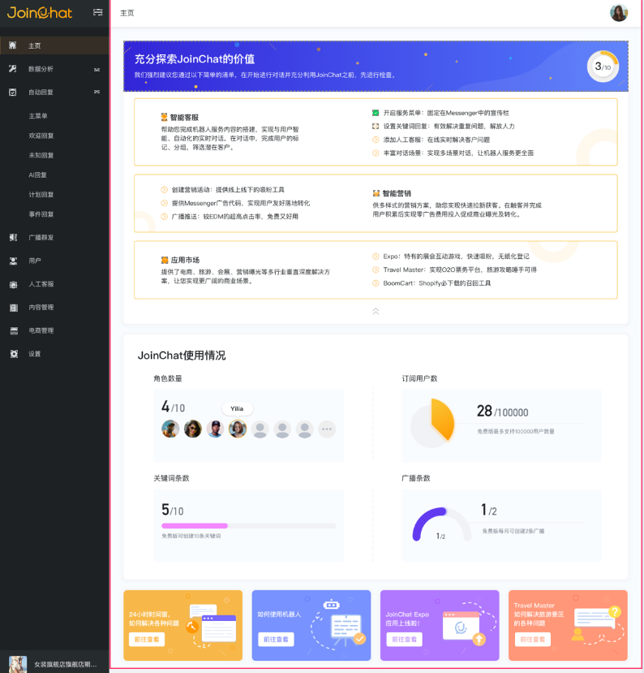

# 主页

主页主要分为3个区域，分别是：充分探索JoinChat的价值、JoinChat使用情况、新闻推送。

## 充分探索JoinChat的价值

在JoinChat系统中，通过该模块展示了JoinChat系统主要功能清单，通过清单列表来了解您的JoinChat系统使用率。

| 功能清单 | 释义 |
| :--- | :--- |
| 服务菜单 |  |
| 关键词回复 |  |
| 人工客服 |  |
| 对话场景 |  |
| 营销活动 |  |
| 广告推送 |  |
| 广播推送 |  |
| Expo应用 |  |
| Travel Master |  |
| BoomCart |  |

## JoinChat使用情况

JoinChat系统针对用户权限设置了四个权限版本：免费版本、体验版本、基础版本和专用版本。JoinChat使用情况模块统计了不同版本的用户在角色数量、订阅用户数、关键词数量和广播条数使用情况概览。

## 新闻推送

新闻推送模块展示了关于JoinChat系统的最新通知及功能软文，通过此模块推送可实时了解JoinChat系统最新动态。

