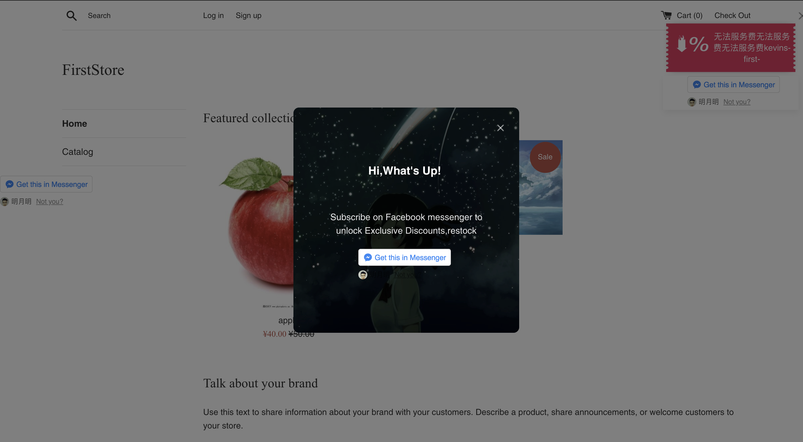

# 关键词回复

用户与机器人进行互动时，除了通过各种按钮与快捷回复的「点击」，还可以通过直接「输入文本」来进行。这就需要我们在设置机器人的时候，对用户可能会输入的关键词，进行相应的回复设置，也就是设置关键词回复规则。

每一条规则主要包含两部分内容：「用户说」和「机器人回复」

关键词回复规则的设置主要就是模拟机器人与用户进行对话的可能，如果用户说的话中包含了一些特定关键词，则会触发预设的回复内容。只有当规则越多越完善，机器人则越智能。

运营人员可以输入多个关键词，当用户输入的内容与您设置的关键词相匹配时，则会触发预设内容，目前针对关键词机器人采取的是包含匹配，户输入的内容包含您设置的关键词就会自动触发。

您也可以不设置任何内容块，则意味机器人不回复任何内容，为了更好的交互，我们当然不建议您这么做。

场景：响应用户输入的问候语

希望当用户输入类似于“Hi”，”Hello” 的短语时，回复用户“欢迎消息”

1-前往【智能回复】-【关键词回复】

2-在右上角点击【新建规则】

3-点击「用户说」这个区域，在输入框中输入“Hi”，回车后输入下一个关键词 “Hello”

4-「机器人回复内容块」中，选择已有消息，找到「欢迎回复」

5-确保启用开关已经打开

为了不断提高机器人的智能化程度，我们在AI回复功能中添加了「未回答问题」功能模块，在这个模块当中会显示所有机器人没有作出正面回答的问题，既可以帮忙运营人员了解用户有哪些问题没有被满足，同时辅助决策是否对某一集中问题进行AI内容的设置。

