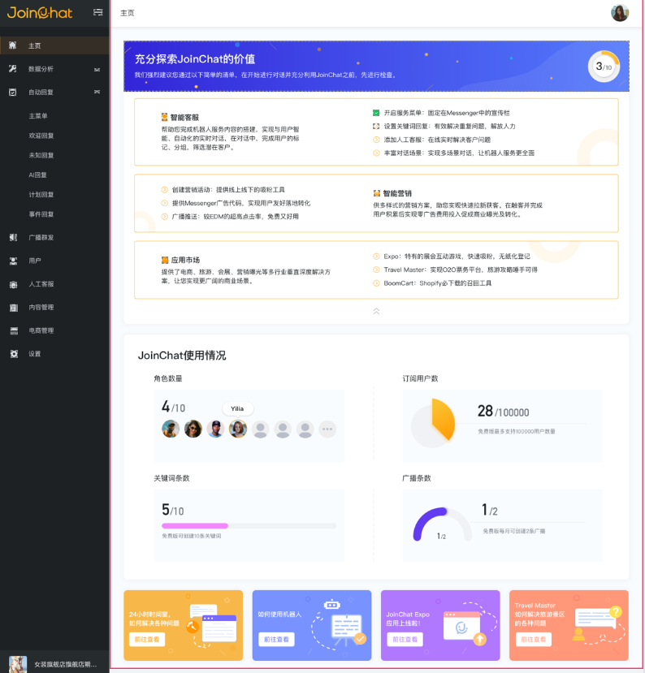
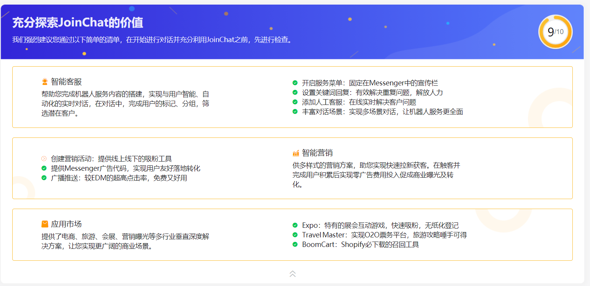
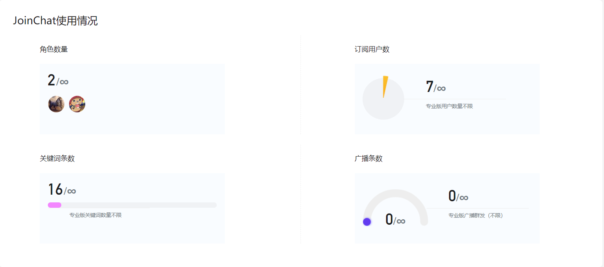
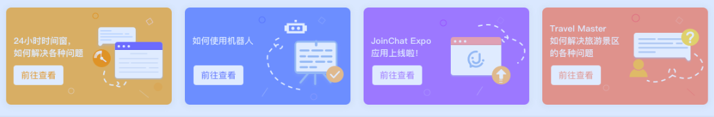

# 主页

主页主要分为3个区域，分别是：使用引导、使用情况、新闻推送。

## 充分探索JoinChat的价值

在JoinChat系统中，通过任务清单模式，将JoinChat核心三大模块：客服、营销和行业应用作为应用的引导。每个模块中，我们列出主要的功能清单，只要您充分了解并运用相应功能，即可实现机器人和用户的友好交互。

当您使用了相应功能后，系统自动完成标记，若果您完成我们列出的10个功能清单后，相信您已经是一位绝世高手了，快去探索吧！

## JoinChat使用情况

JoinChat系统针对用户权限设置了四个权限版本：免费版、基础版、高级版和专用版本。该模块统计了不同版本的用户在角色数量、订阅用户数、关键词数量和广播条数使用情况概览。

## 新闻板块

新闻板块展示了关于JoinChat相关通知、动态、Facebook的更新以及最新、最快的行业解决和营销趋势等。通过此模块可以让您快速了解我们以及行业的最新动态。

