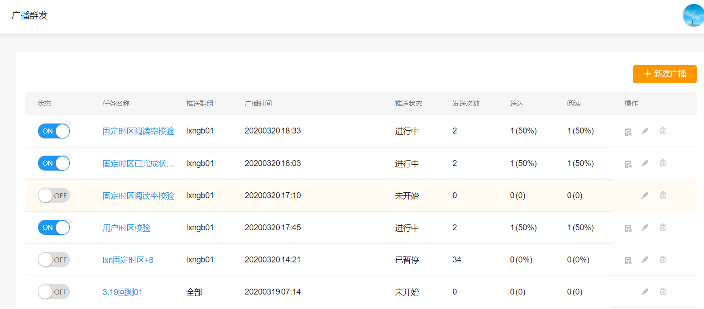
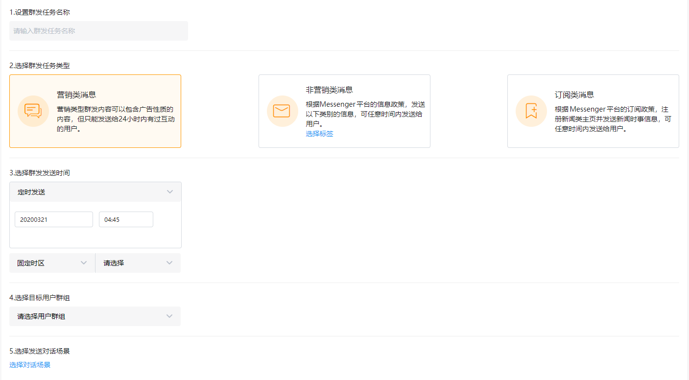
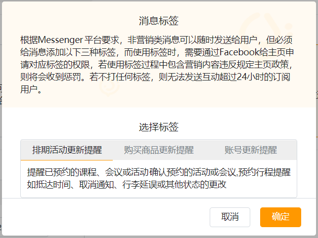
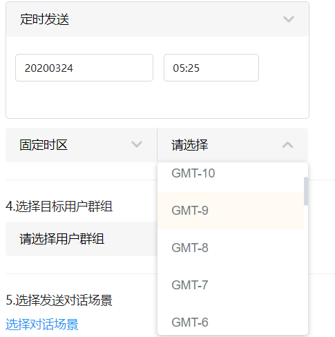
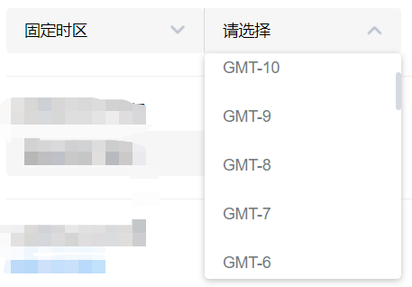

# 广播群发

## 广播消息

在 Messenger 中，机器人与用户最常用的交流方式是进行一对一的对话，但有时也需要向所有人群或者一组特定的人群发送消息。例如，获得批准可以发送订阅消息的 Messenger 机器人通常需要将更新内容发送给数以万计或更多的用户。因此「广播群发」功能即成为了运营人员定向营销推广的利器，在这里可以任性的给24小时内聊天的用户推任何营销消息（建议给那些订阅了机器人的人群推广，查看[订阅机器人](../basic-knowledge/zu-cheng-jie-gou.md#ding-yue-ji-qi-ren-he-qu-xiao-ding-yue-ji-qi-ren)）。

进入广播群发页面，首先会看到任务列表页，展示所有已创建的群发任务。点击右上角「新建群发」，即可创建一条新的群发任务，群发任务包含任务名称、任务类型、发送时间、发送对象及发送内容。发送时间分为两种类型：定期发送和定时发送。定时发送属于一次性发送任务，定期任务可实现定期循环发送。用户可根据实际业务需求来选择定时发送或定期发送。

~~您可以为群发任务设定一个名字群发日期、时间、类型（营销类或非营销类），选择创建~~[~~用户群~~](../she-zhi/yong-hu.md#yong-hu-qun)~~和群发消息。我们支持立即群发和定时群发，方便您有计划的推送消息。~~

## 消息标签

按照Facebook Messenger的平台政策，对于广播类消息，我们只会发送给24小时内和我们的Messenger聊过天的用户，不会发送给其它用户，并且广播消息中，允许发送营销类的消息。

广播任务若为非营销类消息（不限发给24小时内互动用户），则需要给消息内容进行标签分类。

请注意，根据Facebook推广政策，推送带有营销内容的消息必须勾选“营销类消息”，作为非营销类消息群发会面临被Facebook警告甚至封号的风险。虽然订阅消息的推送，并不受24小时这个限制，但是，Facebook目前的平台政策，对于订阅消息不允许推送广告或者推广类的消息，只能推送新闻、日历提醒、支付账单等效率类信息，以及个人信息追踪等工具类信息。

## 多时区

JoinChat提供设置多时区，为服务不同国家的机器人选择最合适的时区来服务用户。

创建定广播群发的时候，可以选择使用~~机器人的~~固定时区，还是用户时区，如果您选择了用户时区，推送的时间会按照用户在Facebook中为自己选择的国家时区来进行。

对于推送时区的选择，JoinChat建议您遵循这样的原则，如果是新闻等每日定时推送的消息，建议您使用用户时区，使得内容尽可能和用户的日常作息时间有关联，譬如，在每天早上9点为用户推送早间新闻，选择用户时区是最合适的。而如果是一次性的通知，可以考虑使用Bot的时区，比如，明天您要举办线下的活动，提前24小时在您的时区告知用户是更合适的。

在设置中，我们可以对机器人时区进行[设置](../she-zhi/ji-chu-she-zhi/#ji-qi-ren-duo-shi-qu)。


根据Facebook推广政策，推送带有营销内容的消息必须勾选“营销类消息”，作为非营销类消息群发会面临被Facebook警告甚至封号的风险。


