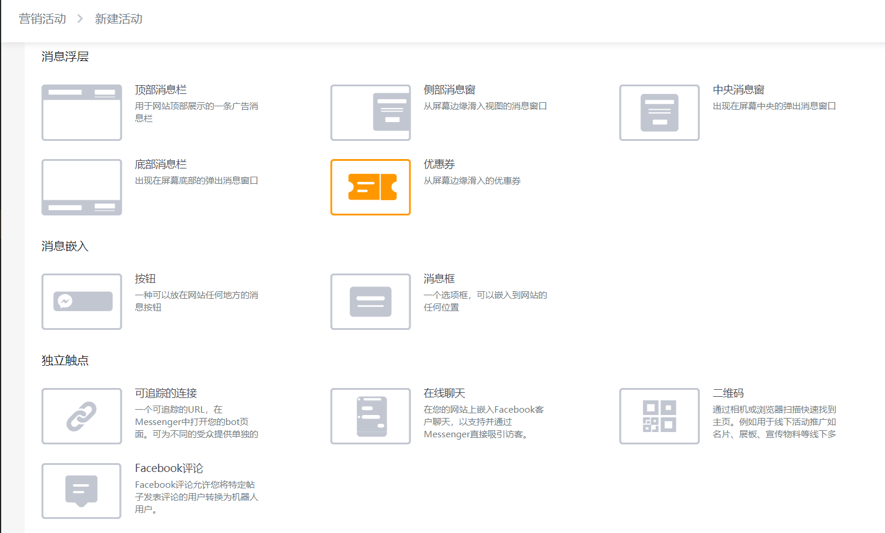
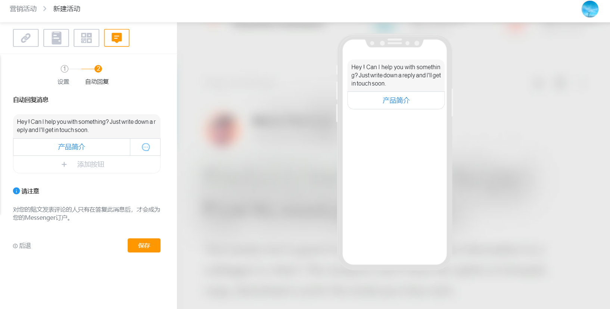

# 营销活动

## 推广工具，给Messenger带来更多流量 

在用户和Messenger对话之后，Messenger机器人可以主动向用户发送消息，重新激活用户和我们沟通，所以我们希望尽可能让更多的用户和Messenger进行对话，累积更多的用户。

除了用户主动从Facebook Page上的Messenger入口主动和您的Messenger机器人聊天，或者用户从Facebook Messenger中通过搜索找到您的Messenger机器人之外，Messenger 支持多种[访问方式](../ru-men-jie-shao.md#fang-wen-messenger-ji-qi-ren-fang-shi)，而“推广插件”功能就是将这些推广方式的入口都统一起来，方便商户去管理。同时还提供了相应的数据报表，即“流量来源”，帮助商户全面掌握各项推广方式的实际效果。

每个插件都是独立的，因为JoinChat为每个插件赋予了一个Ref码，用于记录跟踪插件的使用情况。不但可以记录插件被使用的次数，还能够记录每个插件为您带来的新用户数。

## M链接

M链接是机器人的专属短链接，通过短链接可以快打开Messenger和机器人进行对话。除了为机器人自动生成了一个带有Ref码参数的短链接，我们还支持自动为该端链接生成二维码，同时针对二维码可以添加图片或已经生成的印章。因此，我们可以通过使用带有扫描二维码功能的照相机、浏览器等其他第三方工具快速打开机器人。

每次新建的M链接都带有不同的Ref码，用于记录唯一码的使用情况，实现扫描每一个二维码推送的消息都是不一样的。这样，在线上或线下场景中，可以通过使用二维码来实现活动的效果跟踪。例如以超链接的形式加入到商务电子邮件签名或在线上渠道发布集成链接的二维码，可以让用户通过相机或浏览器扫描快速找到主页。

二维码营销活动流程只需两步，即「触发推送」配置和「安装」配置。

在「触发推送」配置界面设置活动名称及推送的消息流，在「安装」界面可使用默认生成二维码或上传个性二维码都可。


点击「M链接」并不会重置24小时窗口期。因此，已对话的用户在超过24小时窗口期的情况下第二次点击短链接时，将无法收到任何消息。


## 聊天插件

聊天插件以显著的图标自由安装在企业网页之上，当客户与企业对话时，就会弹出一个界面，与用户在移动设备上使用Messenger App显示的界面风格相同。例如配合创建机器人后可以搭配使用成为公司的显著咨询窗口，帮您留住客户信息。

在线聊天营销活动流程只需两步，即「触发推送」配置和「安装」配置。

在「触发推送」配置界面除了名称描述以外，我们还可以设置插件在网站中登录欢迎语和未登录欢迎语以及按钮背景颜色。

「安装」配置界面会针对「触发推送」配置的内容生成Html代码和插件代码。在此界面也可设置指定页面隐藏或显示以及显示设备的配置功能。完成编辑后即可拷贝链接或者代码，放在想要进行推广的地方（如商户的 EDM、官网等）。具体插件的使用教程可以通过预览区的视频按钮进行查看。

~~通过为聊天插件进行基础配置：如语言、颜色、登陆欢迎语和未登录欢迎语，完成编辑后即可拷贝链接或者代码，放在想要进行推广的地方（如商户的 EDM、官网等）。具体插件的使用教程可以通过预览区的视频按钮进行查看。~~

## 发送至Messenger插件

该插件可以自定义附带消息。例如当客户浏览电商网站，看到感兴趣的商品想进一步询问时点击该插件，预置发送的优惠信息等就会立刻推送到客户的 Messenger 中，让您与客户快速建立场景关系，促成销售转化。

在配置插件当过程中，除了名称描述以外，我们还可以设置插件在网站中显示当尺寸、默认显示当语言、按钮上的文本以及按钮的颜色。完成配置后，就会针对配置的插件生成Html代码和插件代码。代码的使用方法和聊天插件一样，具体插入代码的方法可以进入聊天插件中查看使用教程。

## 印章

Messenger印章的原理与M链接相同，用户无需访问网址，只需通过MessengerAPP扫描您专属的印章即可与您开始对话。例如用于线下活动推广如名片、展板、宣传物料等线下多种场景，还能帮您统计活动效果。

创建新印章后，JoinChat会自动为您生成印证的实际样式，针对样式您可以自行选择尺寸，并为扫描该印章后配置特定的消息流。只需保存印章图片至本地，就可以放在任何相放的地方，并了解印章的使用情况。

## 优惠券插件

优惠券插件通过优惠行为鼓励用户与商家进行互动从而获取新用户的Messenger，实现用户追溯、召回及再营销等行为。

优惠券的标题文案可以自行设置，以详实的文案引导客户主动点击，例如“点击插件将会获得一张8折优惠券“。这里客户点击后发送到客户Messenger的消息也需要在这里配置，JoinChat针对不同商家提出了不同的解决方案。

Shopify商家可以通过JoinCha快速创建符合Shopify规则的优惠券，即在JoinChat创建的优惠券也会显示在Shopify的优惠券管理后台中。其他商家可以将店铺的优惠券码，折扣比填入输入框中。


填入优惠码时，请按照格式要求填入优惠码，即优惠码+折扣比，因为JoinChat推送到客户Messenger中的文案会以固定模板的格式提取“码“和“比“，日后我们会将此功能变得更灵活。


用户在点击插件后，用同个浏览器访问店铺，都不会再看到插件。若关闭该插件，刷新页面或打开新页面时会再次看到优惠券。

插件的使用方式和其他插件插入代码的方式一样。

## Facebook评论

Facebook评论可实现将特定帖子发表评论的用户转换为机器人用户。即当用户在你的Facebook帖子下回复内容后，系统会自动通过你的 Messenger 机器人向用户发一条消息。即可以通过Facebook 帖子获得用户流量。同时，我们还可以根据用户的不同评论内容发送特定的不同的消息，从而实现用户转化。

进入营销活动页面，首先会看到任务列表页，展示所有已创建的营销活动。点击右上角「新建活动」，选择营销活动类型界面，点击「Facebook评论」即可进入活动创建界面。

创建Facebook评论营销活动流程只需两步，即「设置」配置和「回复」配置。

Facebook评论营销活动「设置」界面可在帖子列表选择帖子来创建营销活动，设置界面包含功能模块有：活动名称、评论规则设置功能、关键字自动回复功能、帖子列表同步、帖子预览等功能。帖子列表与Facebook主页的帖子是同步的，可根据实际业务需求选择帖子及设置帖子评论关键字等功能，详见下图：

Facebook评论营销活动「回复」界面即用户评论后回复用户内容的配置界面，可根据业务需求回复用户文本内容或引用业务Flow等，从而实现用户信息采集及用户转化。

Facebook评论营销活动创建成功后，点击发布即可生效，用户在评论贴子时会收到设置的回复内容及转化成机器人用户。

